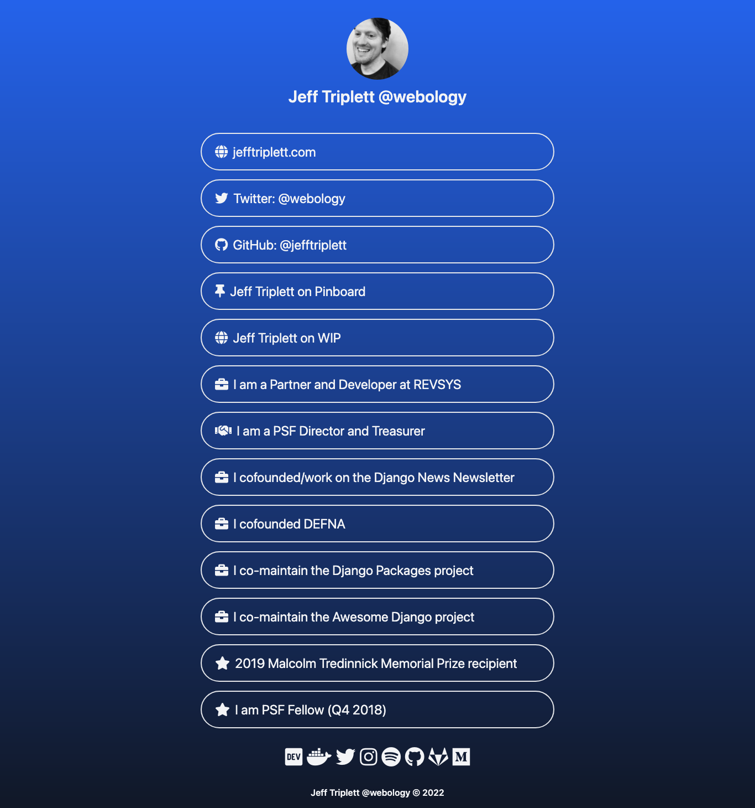

# webolgy.dev

tl;dr I built a Linktree-clone using GitHub Pages (Jekyll), TailwindCSS (JIT), and Font Awesome.

Longer: I bought webology.dev a few years back and wanted to build a more generic place to point people to things I'm doing instead of seeing that I don't blog enough.

## Website Preview
{:width="50%"}

## Social Preview
{:width="50%"}

## Original Theme

This website started off as a fork of [Indigo-based Minimalist Jekyll Template](https://github.com/zchef2k/indigo-linkinbioa) then grew legs of its own.

## Original License

[MIT](https://kopplin.mit-license.org/) License © Sérgio Kopplin
